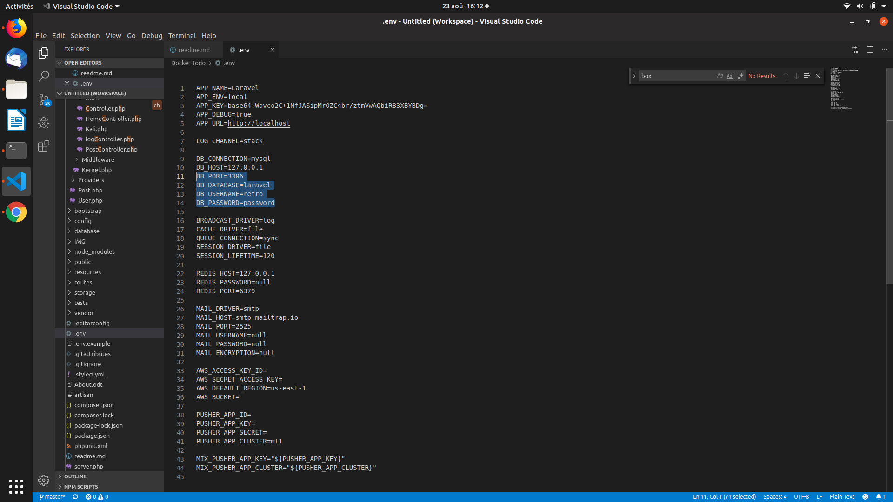

##  :page_facing_up: Quelques liens utiles.

- :white_check_mark: [Simple, fast routing engine](https://laravel.com/docs/routing).
- :white_check_mark: [Powerful dependency injection container](https://laravel.com/docs/container).
- :white_check_mark: Multiple back-ends for [session](https://laravel.com/docs/session) and [cache](https://laravel.com/docs/cache) storage.
- :white_check_mark: Expressive, intuitive [database ORM](https://laravel.com/docs/eloquent).
- :white_check_mark: Database agnostic [schema migrations](https://laravel.com/docs/migrations).
- :white_check_mark: [Robust background job processing](https://laravel.com/docs/queues).
- :white_check_mark: [Real-time event broadcasting](https://laravel.com/docs/broadcasting).

##  :cd: Installation - Linux Ubuntu

 La première chose, c'est de s'assurer d'avoir les éléments requis pour faire fonctionner ce projet.   Les éléments nécessaires sont les suivants : 

<ul> 
<li>  :arrow_right: PHP version 7.3.8 ( Ou supérieur ).</li>
<li>  :arrow_right: Composer version 1.9.0 ( Ou supérieur ). </li>
<li>  :arrow_right: Laravel 5.8.32 ( Ou supérieur ). </li>
<li>  :arrow_right: Node version 10.16.0 ( Ou supérieur ). </li>
<li>  :arrow_right: Mysql version 5.7.27 ( Ou supérieur ). </li>

</ul>

 Nous allons aborder l'installation sur Ubuntu Linux. Je n'ai pas pu mettre mon projet en développement sur MacOS ou Windows, aussi si vous poursuivez cette démarche n'hésiter pas à mes partager vos ressources pour que d'autres personnes puissent profiter du guide d'installation pour leur système d'exploitation.

 Pour l'installation des outils nécessaires j'ai suivi le guide de <a href="https://linuxhint.com/install-laravel-on-ubuntu/" target="_blank"> <i>linux hint</i></a> nous allons donc voir comment cela fonctionne. 

## :cd: Installation de PHP

 Pour faire l'installation de PHP, nous allons exécuter dans notre terminal les commandes ci-dessous dans cette ordre : 

:arrow_right: <b>sudo apt update</b>  <em>( Mise à jour du gestionnaire de paquet )</em>.

:arrow_right: <b>sudo apt-get install php </b><em>( Installation de PHP )</em>

:arrow_right: <b>php -v </b><em>( Vérification de votre version de PHP )</em>

:arrow_right: <b>sudo apt-get install curl</b><em>( Installation d'extensions nécessaires au fonctionnement de Laravel)</em>

:arrow_right: <b>sudo apt-get install php7.1-zip </b><em>( Dépaquetage du fichier php7.1-zip )</em>

:arrow_right: <b>sudo apt-get install php7.1-mbstring </b><em>( Dépaquetage du fichier php7.1-mbstring)</em>

:arrow_right: <b>sudo apt-get install php-xml </b><em>( Dépaquetage du fichier php-xml)</em>

:arrow_right: <b> curl -sS https://getcomposer.org/installer | sudo php ----install-dir=/usr/local/bin --filename=composer</b><em> ( Installation de Composer)</em>

 :white_check_mark: <em> Après cette commande vous pouvez vérifier la présence de composer en tapant <b> composer </b> dans votre terminal </em>

:arrow_right: <b>sudo chown -R $USER .composer/ </b><em> (Modification des permissions du dossier /composer)</em>

:arrow_right: <b>sudo apt-get install git </b><em> ( Installation d'un package Git)</em>

:arrow_right: <b>echo 'export PATH="$HOME/.composer/vendor/bin:$PATH"' >> ~/.bashrc </b><em> (Vous permettras de lancez des commandes Laravel depuis votre terminal)</em>

:arrow_right: <b>source ~/.bashrc </b><em> (Vous permettras de lancez des commandes Laravel depuis votre terminal)</em>

 

:arrow_right: <b> sudo composer global require "laravel/installer" </b><em> ( Installation de Laravel)</em>

 
## :cd: Création d'un projet Laravel

:arrow_right: <b>  composer create-project --prefer-dist laravel/laravel blog </b><em> ( Création d'un dossier blog compatible avec Laravel)</em>

:arrow_right: <b>  php artisan key:generate </b><em> ( Génére une clé pour votre projet )</em>

 Il ne vous manque plus qu'une base de données pour pouvoir utiliser Laravel, j'ai choisis d'installer Mysql et de l'utiliser via le CLI de Ubuntu, mais vous pouvez vous renseignez pour obtenir une interface graphique en installant PhpMyAdmin par exemple 

 

## :cd: Installation de Mysql et création d'une base de données.

 

 Pour l'installation de Mysql j'ai suivi le guide de <a href="https://itsfoss.com/install-mysql-ubuntu/" target="_blank"> <i>itsfoss</i></a>

:arrow_right: <b>  sudo apt install mysql-server -y </b><em> ( Installation de Mysql )</em>

:arrow_right: <b>  sudo mysql -v </b><em> ( Vérification de la version de Mysql )</em>

 Nous allons procéder à la création de la base de données, pour exécuter des commandes mysql vous pouvez lancez la commande ci-dessous : 

:arrow_right: <b>  mysql -u root -p  </b>

 Nous allons maintenant créer un utilisateur . 

:arrow_right: <b>  CREATE USER 'testuser'@'localhost'; </b>

<em>Remplacez 'testuser' par le nom d'utilisateur désiré.</em>

:arrow_right: <b>  SELECT User,Host FROM mysql.user; </b> <em>( Affiche les utilisateurs)</em>

:arrow_right: <b>  CREATE DATABASE laravel; </b> <em>( Crée une base de données avec pour nom : laravel)</em>

:arrow_right: <b> SHOW DATABASES; </b> <em>( Vérification de la liste des bases de données)</em>

:arrow_right: <b> GRANT ALL PRIVILEGES ON database_name.* TO 'username'@'localhost'; </b> <em>( Défini les priviléges nécessaires à l'utilisateur)</em>

<em> Remplacez database_name par laravel ( dans notre cas) , et 'username'@'localhost' par 'testuser'@'localhost' ( dans notre cas). </em>

:arrow_right: <b> SET PASSWORD FOR 'testuser'@'localhost' = PASSWORD('password'); </b> <em>( Défini un mot de passe à l'utilisateur)</em>

<em> Vous pouvez modifier 'testuser' par le nom de l'utilisateur et PASSWORD('password') en mettant dans les parenthèses le mot de passe désiré.</em>

:arrow_right: <b>  FLUSH PRIVILEGES; </b> <em>(Sauvegardez les changements effectués)</em>

 Vous devriez en avoir terminer avec les installations, pour le déployement de mon projet vous aurez besoin d'une base de données donc vous aurez accès au informations de connexion nécessaires. 

Voici un lien qui répertorie bon nombre de commande utiles en Mysql  <a href="http://www.zbeanztech.com/blog/important-mysql-commands" target="_blank"> <i>http://www.zbeanztech.com/blog/important-mysql-commands</i></a>

## :cd: Installation de Node.js

 Pour l'installation de Node.js j'ai suivi le guide de <a href="https://tecadmin.net/install-latest-nodejs-npm-on-ubuntu/" target="_blank"> <i>TecAdmin</i></a>

:arrow_right: <b>  sudo apt-get install curl </b><em> ( Déployement du PPA )</em>

:arrow_right: <b> curl -sL https://deb.nodesource.com/setup_12.x | sudo -E bash - </b><em> ( Déployement du PPA  )</em>

:arrow_right: <b> sudo apt-get install nodejs </b><em> ( Installation de Node.js )</em>

:arrow_right: <b> node -v  </b><em> ( Vérification de la version de Node.js )</em>

:arrow_right: <b> npm -v   </b><em> ( Vérification de la version de npm )</em>

  :star2: À ce stade vous posséder tout l'environnement nécessaires pour déployer la ToDo List 

##  :computer: Déployement de la todouxliss't

 Pour commencer nous allons cloner le repo, je ne vous fait pas l'affront de vous écrire la commande  :stuck_out_tongue_closed_eyes: . 

 Une fois le repo cloner, vous êtes l'heureux propriétaire d'un dossier nommer<b>  " ToDouxLiss-t "</b>, ouvez votre terminal entrez dans ce dossier et naviguez jusqu'au dossier nommer : <b> Docker-Todo </b> pour lancer les commandes qui vont suivre. 

:arrow_right: <b>  npm install  </b> <em>(Installation de certaines dépendances)</em>

 Vous allez devoir vérifier certaines informations contenue dans le fichier .env ( ce fichier peut être masquer) contenu à la racine de votre projet, et donc du dossier Docker-Todo 

 Dans les lignes en surbrillance sur l'image précédente, remplacer les champs par ceux qui correspondent à celles de votre base de données 

:arrow_right: <b>  php artisan migrate  </b> <em>(Va créer des tables et champs nécessaires)</em>

<em>Si vous obtenez en retour " Nothing to migrate " alors tout va bien.</em>

 En vous rendant à l'adresse <a href="http://localhost:8000/" target="_blank"> http://localhost:8000/ </a> vous devriez maintenant avoir accès à votre toDouLiss't 
